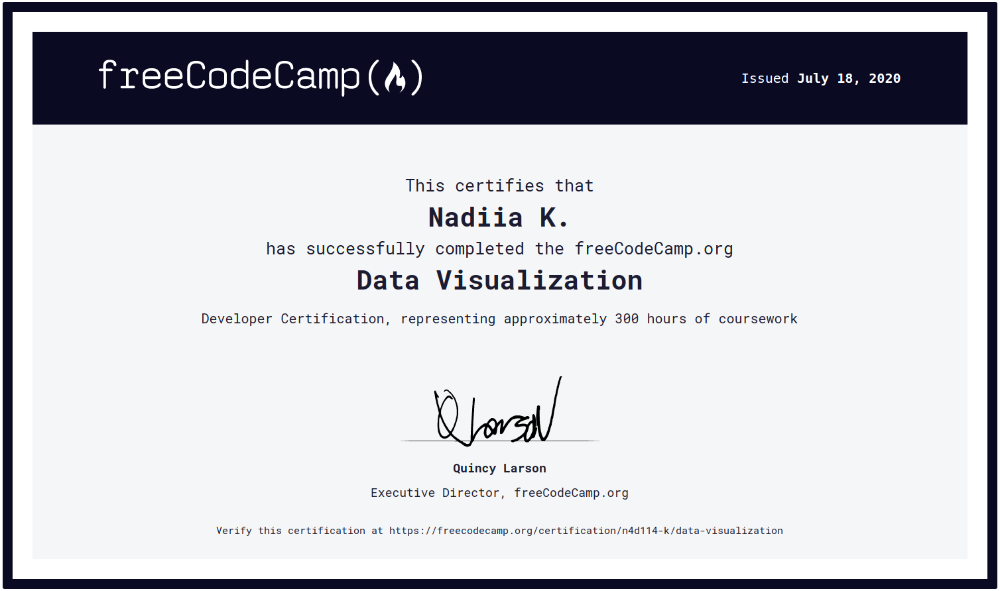

# [freeCodeCamp Certifications Projects](https://www.freecodecamp.org/)

My freeCodeCamp [profile](https://www.freecodecamp.org/n4d114-k)

***

### [Data Visualization Projects](https://www.freecodecamp.org/learn/data-visualization/data-visualization-projects/)
[codepen.io collection](https://codepen.io/collection/AzmQJW "My solution on codepen.io")

***

### [JavaScript Algorithms and Data Structures Projects](https://www.freecodecamp.org/learn/javascript-algorithms-and-data-structures/javascript-algorithms-and-data-structures-projects/)
[repl.it folder](https://repl.it/repls/folder/FCC_JavaScript_Certification_Projects)

***

### [Responsive Web Design Projects](https://www.freecodecamp.org/learn/responsive-web-design/responsive-web-design-projects/)
[codepen.io collection](https://codepen.io/collection/Dgogoz "My solution on codepen.io")

